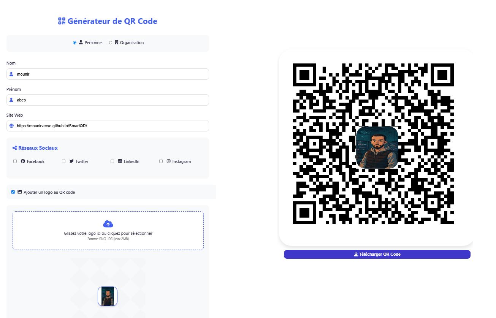

# SmartQR 🚀

[](https://opensource.org/licenses/MIT)


---

**A smart, customizable QR code generator with logo embedding, social profiles, and multilingual UI.**

👉 **Live Demo:** [mounirverse.github.io/SmartQR](https://mounirverse.github.io/SmartQR/)

---

 <!-- Make sure to add the screenshot image in the /assets folder -->

---

## ✨ Features

| Feature                | Description                                                                 |
|------------------------|-----------------------------------------------------------------------------|
| 🎨 **Custom QR**        | Change colors, add logos, and adjust corner radius for personalized QR codes. |
| 🌐 **Social Links**     | Direct QR links to Facebook, Twitter, LinkedIn, and Instagram profiles.      |
| 🌙 **Dark Mode**        | Toggle between light and dark themes for a customized look.                   |
| 🗣 **3 Languages**      | Supports English, French, and Arabic.                                       |
| 📥 **Instant Download** | Save your QR code as a high-resolution PNG (up to 1024x1024).                |
| 📱 **Mobile-Friendly**  | Fully responsive and works flawlessly on all devices.                        |

---

## 🚀 Quick Start

### Use Online

1. **Visit** [mounirverse.github.io/SmartQR](https://mounirverse.github.io/SmartQR/) to start generating your QR codes instantly!

### Run Locally

1. **Clone the repository**:
   ```bash
   git clone https://github.com/mounirverse/SmartQR.git
   cd SmartQR
Open the app: Simply open index.html in your preferred browser to run the app locally.

🛠️ How It Works
User Flow:

Enter your details (name, website, and social handles).

Customize the QR code's style (color, logo, corner shape).

Generate and download the QR code instantly.

Technical Stack:

Frontend: Pure HTML, CSS, and JavaScript (no frameworks).

QR Library: QRious for QR code generation.

Icons: Font Awesome for social media icons.

Hosting: GitHub Pages for live deployment.


🌍 Live Demo
Try it now: [SmartQR Demo](https://mounirverse.github.io/SmartQR/)

📜 License
Open-source under the MIT License. Feel free to use, modify, and distribute this project, just provide attribution.

🤝 Contributing
Fork the project.

Create a branch (git checkout -b feature/YourFeature).

Make your changes and commit (git commit -m 'Add amazing feature').

Push to your branch (git push origin feature/YourFeature).

Open a Pull Request.

💡 Pro Tip
Want a branded QR code for your business card? Simply upload your logo and choose your brand colors!
